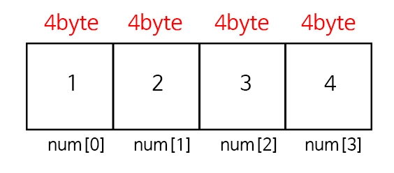

# Day 1: 배열(Array)과 리스트(List)

> 📅 2025.02.13 | 📁 Week 1

---

## 🧠 학습 질문

-   [x] 배열의 접근이 O(1)인 이유를 메모리 주소 계산 관점에서 설명하면?
-   [x] 배열의 중간 삽입/삭제가 O(n)인 이유는?
-   [x] 동적 배열이 크기가 가득 찼을 때 2배로 확장하는 이유는?
-   [x] 재할당 시 기존 요소들을 복사하는데 왜 amortized O(1)이 되는가?
-   [x] Cache locality 관점에서 배열이 연결 리스트보다 유리한 이유는?
-   [x] 연결 리스트와 배열 중 어떤 상황에서 무엇을 선택해야 하는가?

## 배열의 접근이 O(1)인 이유를 메모리 주소 계산 관점에서 설명하면?

배열의 핵심은 연속된 메모리 공간에 데이터가 배치된다는 점이다.



**주소 계산 공식**

$\text{Address}(i) = \text{Base Address} + (i \times \text{Size})$

-   cpu는 인덱스 i가 무엇이든 상관없이 **덧셈 한 번, 곱셈 한 번**의 산술 연산만으로 즉시 물리적 메모리 주소에 도달할 수 있다.
-   데이터의 개수(n)와 상관없이 계산 시간이 일정하므로 시간 복잡도는 $O(1)$이 된다.

**랜덤 접근(Random Access)의 의미**

-   배열은 index → address 변환이 상수 시간이라 ‘random access’ 자료구조의 대표
-   연결 리스트는 i번째 노드의 주소를 계산할 수 없고, 포인터를 따라가며 탐색해야 하므로 접근이 O(n)

## 배열의 중간 삽입/삭제가 O(n)인 이유는?

배열은 중간에 빈 공간을 허용하지 않는 자료구조이다. 연속성을 유지하기 위해 shift가 발생한다.

-   삽입: 특정 위치에 데이터를 넣으려면, 그 뒤에 있는 모든 요소들을 한 칸씩 뒤로 밀어내야 공간이 생긴다.
-   삭제: 빈 공간을 채우기 위해 뒤에 있는 모든 요소들을 앞으로 당겨야 한다.

<aside>
💡

**Worst Case**

가장 첫 번째 인덱스에 데이터를 삽입하거나 삭제할 경우, 나머지 n-1개의 요소를 모두 이동시켜야 하므로 $O(n)$의 시간이 걸린다.

</aside>

-   이 비용은 ‘비교’가 아니라 메모리 이동 비용이 지배함
-   cpu 관점에서 n개의 원소를 옮기는 건 결국 n번의 write가 필요
-   동적 배열에서도 중간 삽입은 기본적으로 shift 비용 O(n)은 그대로 존재

## 동적 배열이 크기가 가득 찼을 때 2배로 확장하는 이유는?

동적 배열(Java의 `ArrayList`, Python의 `List`, C++의 `std::vector`)은 가득 찼을 때 공간을 2배(또는 1.5배)로 늘린다.

**기하급수적 증가**

만약 배열을 늘릴 때마다 고정된 크기(ex. +10)만큼 늘린다면, n개의 데이터를 넣을 때 재할당이 n/10번 발생하게 되어 전체 시간 복잡도가 $O(n)$에 가까워진다.

반면, 2배씩 늘리면 재할당 횟수가 로그 단위로 급격히 줄어든다. 메모리 공간을 조금 더 쓰더라도 작업 시간을 단축시키려는 Trade-off 전략이다.

**왜 2배인가?**

-   총 복사 비용이 수학적으로 깔끔하게 linear로 묶임
-   재할당 횟수가 log 규모로 줄어듦
-   평균적으로 빈 공간 비율이 상수로 제한됨

## 재할당 시 기존 요소들을 복사하는데 왜 amortized O(1)이 되는가?

> 비싼 복사가 매번 일어나지 않고, 드물게만 일어나며 그 비용이 전체로 분산되기 때문

**동적 배열의 메모리 구조**

```bash
[ 10 ][ 20 ][ 30 ][  _ ][  _ ]
  ↑
 base address
 capacity = 5
 size = 3
```

capacity 꽉 참

```bash
[ 10 ][ 20 ][ 30 ][ 40 ][ 50 ]
size = 5
capacity = 5
```

여기서 append(60)을 하면?
배열은 연속된 메모리 공간임 → 바로 뒤 메모리가 비어있다는 보장x → **기존 메모리 뒤에 그냥 붙일 수 없음**

1. 더 큰 메모리 블록을 새로 할당한다 (예: 10칸)
2. **기존 원소 5개를 새 메모리로 복사**한다
3. 새 원소를 추가한다
4. 기존 메모리는 해제한다

```bash
기존 메모리:   [10][20][30][40][50]

새 메모리:     [10][20][30][40][50][60][ _ ][ _ ][ _ ][ _ ]
```

이 과정을 재할당(reallocation)이라고 한다.
기존 원소 n개에 대해 n번의 복사가 필요하므로 **한 번의 재할당 비용=O(n)**

그렇다면 왜 amortized O(1)인가?

append를 n번 한다고 해보자. capacity가 꽉 차면 2배로 늘리고 전체를 복사한다.

-   capacity: 1→2→4→8→..→$2^m$
-   각 확장 때 복사량:
    -   1개 복사, 2개 복사, 4개 복사.., $2^{m-1}$개 복사

총 복사량 햡:

$$
1+2+4+⋯+2^{m−1}=2^m−1
$$

그리고 2^m은 최종 원소 수 n에 비례하므로 총 복사량은 O(n)

-   append “n”번에 대한 총 비용이 O(n)
-   그러면 1번 append 당 평균 비용은 O(1)

→ 이게 amortized O(1) 이다.

## Cache locality 관점에서 배열이 연결 리스트보다 유리한 이유는?

> 배열은 spatial locality가 강하고, 리스트는 포인터 추적으로 cache miss가 많음

cpu는 메모리를 직접 접근하지 않는다. 계층 구조가 있다.

```bash
Register  (가장 빠름)
L1 Cache
L2 Cache
L3 Cache
RAM
Disk      (가장 느림)
```

ram이 L1보다 느리니까 cpu는 자주 쓰는 데이터를 cache에 올려두고 재사용한다.

spatial locality(공간적 지역성): 어떤 메모리 주소를 사용하면, 그 근처 주소도 곧 사용될 가능성이 높다.
→ CPU는 메모리를 한 바이트씩 가져오지 않고 보통 cache line(예. 64B) 단위로 가져온다.

**배열의 장점**

-   원소들이 연속이라서 `A[i]`를 읽으면 같은 cache line에 `A[i+1], A[i+1]..`가 같이 딸려옴
-   순회(traversal)할 때 prefetcher가 다음 라인을 미리 끌어오기도 쉬움
-   결과적으로 cache hit 비율 ↑, 메모리 대기시간 ↓

**연결 리스트의 단점**

-   노드가 힙 여기저기에 흩어질 가능성이 큼 - fragmentation
-   다음 노드로 가려면 next 포인터를 따라가야 하는데, 이 주소는 예측이 어려워서 pointer chasing
-   한 노드를 가져오려고 cache line 을 당겨왔는데, 유효 데이터는 노드 일부 + 포인터 뿐 → cache line 낭비
-   branch prediction도 불리해질 수 있음

결과: 이론상 리스트 순회도 O(n)이지만, 실제 시간은 배열 순회보다 훨씬 느린 경우가 많음

## 연결 리스트와 배열 중 어떤 상황에서 무엇을 선택해야 하는가?

**배열/동적 배열을 선택하기 좋은 경우**

-   인덱스 기반 랜덤 접근이 중요: O(1) access
-   데이터 순회가 많고 성능이 중요: cache locality
-   데이터가 대체로 끝에 추가(push_back/append) 위주
-   메모리 사용을 예측 가능하게 하고 싶고, 오버헤드를 줄이고 싶음
    (리스트는 노드마다 포인터/할당 오버헤드 큼)

**연결 리스트를 선택하기 좋은 경우**

-   삽입/삭제 위치가 이미 노드 포인터로 주어진다 (탐색 비용이 없음)
-   중간 삽입/삭제가 매우 잦고, 배열의 shift 비용이 병목
-   크기가 매우 크고, “큰 연속 메모리 할당”이 어려운 환경(다만 요즘은 이것도 상황에 따라 다름)

---

## 📎 참고 자료

<!-- 공부하면서 참고한 링크를 여기에 추가해주세요 -->

---

## 💬 토론 포인트

<!-- PR 리뷰 또는 스터디 중 나온 추가 질문이나 논의 사항을 기록해주세요 -->
