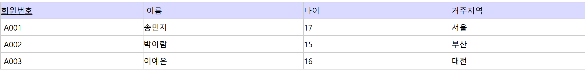

# 정규화(Normalization)

- BCNF(보이스/코드)

> 📅 2025.03.01 | 📁 Week 3
> 

---

## 🧠 학습 질문

## 정규화가 필요한 이유는? 이상 현상(Anomaly)이란?

- 중복된 데이터 방지
    - 테이블 간 중복된 데이터 방지
- 데이터 무결성 개선
    - 데이터 무결성: 데이터의 정확성, 일관성, 유효성이 유지되는 것
        - 데이터의 정확성: 데이터의 중복이나 누락이 없는 상태
        - 데이터의 일관성: 원인과 결과의 의미가 연속적으로 보장되어 변하지 않는 상태
- 이상현상이란?
    - 불필요한 데이터의 중복으로 인해 발생하는 부작용
    - 함수 종속관계 여러개를 하나의 릴레이션으로 표현하는 경우 주로 발생
    - 삽입이상
        - 새 데이터를 삽입하기 위해 불필요한 데이터도 함께 삽입해야 하는 문제
        - 원하지 않는 자료가 삽입된다든지, 삽입하는데 자료가 부족해 삽입이 되지 않아 발생됨
    - 갱**신이상**
        - 중복된 튜플 중 일부 튜플만 변경하여 데이터가 불일치하게 되는 모순이 발생하는 문제
        - 정보가 모호해지거나 일관성이 없어져 정확한 정보 파악이 되지 않음
    - 삭제이상
        - 튜플 삭제 시 하나의 자료만 삭제하고 싶지만, 그 자료가 포함된 튜플 전체가 삭제됨으로 원하지 않는 정보 손실이 발생하는 문제
    
    *이 문제들을 해결하기 위해 정규화 과정을 거친다.*
    

## 제1정규형, 제2정규형, 제3정규형, BCNF의 조건과 차이는?

- 제1정규형
    - 릴레이션에 속한 모든 속성의 도메인이 **원자 값(atomic value)으로만 구성**
    - 즉, 복합 애트리뷰트, 다중값 애트리뷰트, 중첩 릴레이션 등 비 원자적인 애트리뷰트들을 허용하지 않는 릴레이션 형태
- 제2정규형
    - 모든 비주요 애트리뷰트들이 주요 애트리뷰트에 대해서 **완전 함수적 종속**
    - 완전 함수적 종속
        - X->Y 라고 가정했을 때, X의 어떠한 애트리뷰트라도 제거하면 더 이상 함수적 종속성이 성립하지 않는 경우
    - 즉, 키가 아닌 열들이 각각 후보키에 대해 결정되는 릴레이션 형태
- 제3정규형
    - 어떠한 비주요 애트리뷰트도 기본키에 대해서 **이행적으로 종속되지 않으면** 제 3 정규형을 만족
    - 이행 함수적 종속
        - X->Y, Y->Z의 경우에 의해서 추론될 수 있는 X->Y의 종속관계
    - 즉, 비주요 애트리뷰트가 비주요 애트리뷰트에 의해 종속되는 경우가 없는 릴레이션 형태
- BCNF(보이스/코드)
    - 릴레이션의 함수 종속 관계에서 모든 결정자가 후보키
    - 하나의 릴레이션에 여러개의 여러개의 후보키가 존재할 수도 있는데, 이 경우에는 제3정규형까지 모두 만족하더라도 이상 현상이 발생할 수 있음

## 함수적 종속성(Functional Dependency)이란 무엇인가?

- 함수적 종속성이란
    - X의 값을 알면 Y의 값을 바로 식별할 수 있고, X의 값에 Y의 값이 달라질 때, Y는 X에 함수적 종속이라고 함
    - X→Y (X는 결정자, Y는 종속자)
    - 완전 함수적 종속
        - 종속자가 기본키에만 종속되며, 기본키가 여러 속성으로 구성되어 있을경우 기본키를 구성하는 모든 속성이 포함된 기본키의 부분집합에 종속된 경우
        
        
        
        - 기본키: 회원번호
        - '이름', '나이', '거주지역' 속성은 기본키인 '회원번호'을 알아야 식별 가능 ⇒ '이름', '나이', '거주지역'은 '회원번호'에 완전 함수 종속된 관계
    - 부분 함수적 종속
        - 종속자가이 기본키가 아닌 다른 속성에 종속되거나, 기본키가 여러 속성으로 구성되어 있을경우 기본키를 구성하는 속성 중 일부만 종속되는 경우
        
        
        
        - 기본키: 고객ID+제품코드
        - '주문상품'은 기본키 중 '제품코드'만 알아도 식별 가능
        - '주문상품' 속성은 기본키에 **부분 함수 종속**된 관계
    - 이행 함수적 종속
        - X→Y, Y→Z 이란 종속 관계가 있을 경우, X→Z가 성립될 때 이행적 함수 종속
        - 즉, X를 알면 Y를 알고 그를 통해 Z를 알 수 있는 경우
        
        
        
        - 상품번호를 알면 소분류를 알 수 있고, 소분류을 알면 대분류도 알 수 있음
        - 따라서 상품번호를 알면 대분류를 알 수 있음  ( 이행 함수적 종속)

## 정규화의 장단점은? 왜 항상 정규화를 하지 않는가?

- 장점
    - 데이터 중복 감소
        - 정규화된 구조에서는 한 곳에서만 수정하면 되므로 유지보수가 훨씬 간단
    - 데이터 무결성 보장
        - 테이블 간에 관계를 명확하게 정의하고, 데이터가 일관되게 입력되도록 강제함으로써 데이터 무결성을 확보
        - 이는 잘못된 데이터 입력이나 갱신 시 오류를 방지할 수 있음
    - DB 성능 향상
        - 데이터의 수정, 삭제, 업데이트 시 성능이 향상될 수 있음
- 단점
    - 복잡한 JOIN 처리
        - 쿼리의 복잡성을 증가시키며, 특히 많은 데이터를 조회할 때 성능 저하를 일으킬 수 있음
    - 복잡한 트랜잭션 처리
        - 정규화된 데이터베이스는 여러 테이블에 데이터를 나누어 저장하기 때문에, 하나의 트랜잭션이 여러 테이블에 영향을 미침
        - 이로 인해 트랜잭션을 처리하는 과정이 복잡해질 수 있으며, 다중 테이블에 걸친 트랜잭션을 처리하는 데 더 많은 자원을 필요로 함

## 역정규화는 언제 하는가? 어떤 경우에 성능 향상이 되는가?

- **JOIN 비용이 응답 속도를 저해할 때**
    - 대량의 데이터를 가진 테이블들을 빈번하게 조인해야 해서 쿼리 속도가 서비스 요구사항을 충족하지 못할 때
- **통계 및 집계 데이터 조회가 잦을 때**
    - 수만 건의 데이터를 매번 `SUM`이나 `COUNT`로 계산하기보다, 결과값을 별도 컬럼이나 테이블에 미리 저장해두는 방식임
- **분산 데이터베이스(Sharding) 환경일 때**
    - 물리적으로 서버가 나뉘어 조인이 원천적으로 불가능하거나 네트워크 오버헤드가 너무 클 때 데이터를 중복해서 들고 있음
- **조회 성능이 쓰기 성능보다 압도적으로 중요할 때**
    - 데이터가 수정되는 일은 거의 없는데 조회는 초당 수천 번 일어나는 상황(예: 공지사항, 상품 상세정보)에 유리함
- 성능 향상 경우
    - **다수의 테이블 조인 제거**
        - 5~6개의 테이블을 조인하던 쿼리를 하나의 테이블 조회로 끝낼 수 있어 I/O 비용이 획기적으로 줄어듦
    - **필터링 조건의 단순화**
        - 다른 테이블에 있는 값을 현재 테이블로 복사해오면(예: 주문 테이블에 상품 카테고리명을 중복 저장), 인덱스를 타는 검색이 훨씬 단순하고 빨라짐
    - **미리 계산된 값 활용**
        - 주문 총액이나 평균 평점 등을 조회 시점에 계산하지 않고 이미 적재된 값을 읽기만 하므로 CPU 연산 자원을 아낄 수 있음

## 실무에서는 보통 몇 정규형까지 정규화하는가?

- 대부분 3NF 또는 BCNF 까지
- **보통 3NF가 기준인 이유**
    - 대부분의 데이터 이상 현상(삽입, 삭제, 수정 이상)은 3NF까지만 완료해도 거의 해결됨
    - 비즈니스 로직을 설계하고 코드로 구현하기에 가장 직관적이고 효율적인 형태
- **4, 5정규형을 안 하는 이유**
    - 이론적으로는 완벽할지 몰라도 테이블이 너무 잘게 쪼개짐
    - 이는 조인 횟수를 폭발적으로 늘려 성능을 저하시키고, 관리해야 할 테이블 수가 많아져 개발 난이도만 높아짐
- **예외**
    - 금융권이나 공공기관처럼 데이터 정합성이 목숨보다 중요한 곳은 BCNF 이상을 엄격하게 지키기도 함
    - 반면, 로그 저장소나 데이터 웨어하우스(DW)는 1~2정규형 수준에서 역정규화를 강하게 걸기도 함

---

## 📎 참고 자료

[https://p-elideveloper.tistory.com/125](https://p-elideveloper.tistory.com/125)

[https://seosh817.tistory.com/647#함수 종속-1-4](https://seosh817.tistory.com/647#%ED%95%A8%EC%88%98%20%EC%A2%85%EC%86%8D-1-4)

## 💬 토론 포인트

<!-- PR 리뷰 또는 스터디 중 나온 추가 질문이나 논의 사항을 기록해주세요 -->